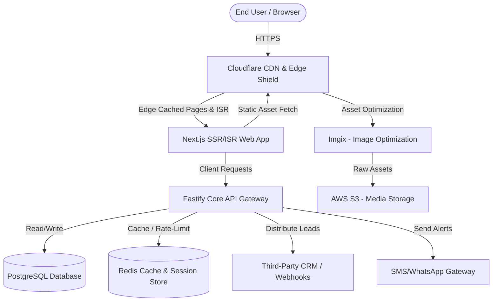
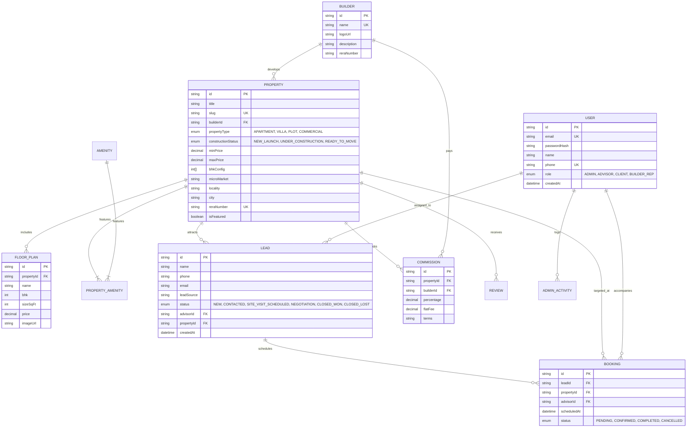
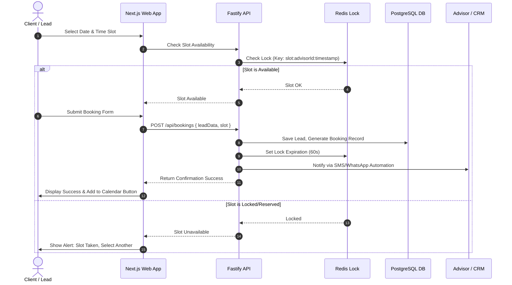
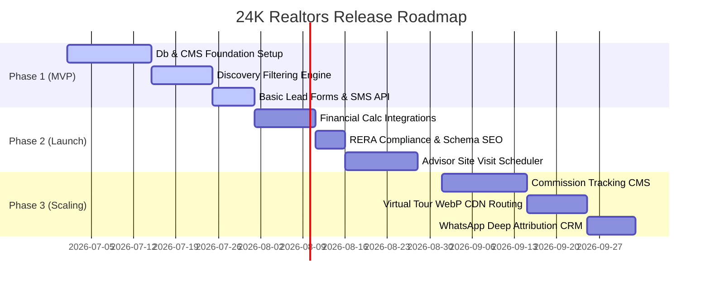

# 24K Realtors: Enterprise Architecture & Technical Specifications

This document defines the system architecture, database schema, engineering implementation details, and development roadmap for the **24K Realtors** premium real estate consultant platform.

---

## 1. System Architecture & Tech Stack

The platform is designed using a **Decoupled Architecture** to optimize for Core Web Vitals (LCP, FID, CLS), SEO indexability, high-performance asset loading, and enterprise-grade lead security.

### 1.1 High-Level Architecture Blueprint



### 1.2 Tech Stack Selection & Justification

| Layer | Technology | Selection Rationale |
| :--- | :--- | :--- |
| **Frontend Web** | **Next.js (React 19, App Router)** | Hybrid SSG/ISR (Incremental Static Regeneration) for lightning-fast page loading (<1.2s LCP) and optimized SEO crawlability. |
| **API Backend** | **Fastify (Node.js)** | Extremely low-overhead framework (up to 5x faster than Express) capable of handling 10k+ requests/sec with minimal resource footprints. |
| **ORM** | **Prisma** | Type-safe query builder that integrates seamlessly with PostgreSQL, preventing SQL injection and simplifying migration workflows. |
| **Database** | **PostgreSQL (v16)** | Rich support for spatial queries (via PostGIS for geo-fencing), JSONB fields for dynamic builder/property specs, and ACID transaction safety. |
| **Caching/Message Queue** | **Redis (v7)** | High-throughput in-memory caching for active property searches, sessions, API rate-limiting, and simple queue processing for lead distribution. |
| **Media Delivery** | **AWS S3 + Imgix + Cloudflare** | Imgix provides dynamic crop, compression, and WebP/AVIF auto-formatting. Cloudflare handles edge caching, SSL, and DDOS mitigation. |

---

## 2. Database Schema Design

The following schema maps the key data models, ensuring full relational integrity, audit tracking for admin actions, and optimization indexes for property filtering.

### 2.1 Entity Relationship Diagram



### 2.2 Database Indexes for Performance Optimization

To guarantee sub-100ms query responses on property discovery, the following compound indexes are implemented:
1. `CREATE INDEX idx_prop_search ON "Property" ("propertyType", "constructionStatus", "minPrice", "maxPrice");`
2. `CREATE INDEX idx_prop_location ON "Property" ("city", "microMarket");`
3. `CREATE INDEX idx_lead_phone ON "Lead" ("phone");`
4. `CREATE INDEX idx_booking_schedule ON "Booking" ("scheduledAt", "status");`

---

## 3. Feature-by-Feature Technical Breakdown

### 3.1 Advanced Property Discovery Engine

The filtering engine must process multiple criteria concurrently without degrading database response time.

#### API Route: `GET /api/v1/properties`
Accepts query parameters: `type`, `status`, `minPrice`, `maxPrice`, `bhk`, `microMarket`, `limit`, `offset`.

#### Sample Prisma Backend Implementation:
```typescript
import { PrismaClient } from '@prisma/client';
const prisma = new PrismaClient();

export async function getProperties(queryParams: any) {
  const { type, status, minPrice, maxPrice, bhk, microMarket, limit = 10, offset = 0 } = queryParams;

  const whereClause: any = {};

  if (type) whereClause.propertyType = type;
  if (status) whereClause.constructionStatus = status;
  if (minPrice || maxPrice) {
    whereClause.minPrice = { gte: minPrice ? parseFloat(minPrice) : 0 };
    if (maxPrice) {
      whereClause.maxPrice = { lte: parseFloat(maxPrice) };
    }
  }
  if (bhk) {
    // bhk config is stored as an Int[] array, e.g. [2, 3]
    const bhkList = bhk.split(',').map((n: string) => parseInt(n, 10));
    whereClause.bhkConfig = { hasSome: bhkList };
  }
  if (microMarket) {
    whereClause.microMarket = { equals: microMarket, mode: 'insensitive' };
  }

  const [properties, total] = await prisma.$transaction([
    prisma.property.findMany({
      where: whereClause,
      include: { builder: { select: { name: true, logoUrl: true } } },
      take: parseInt(limit, 10),
      skip: parseInt(offset, 10),
      orderBy: { isFeatured: 'desc' },
    }),
    prisma.property.count({ where: whereClause }),
  ]);

  return { properties, total, limit, offset };
}
```

---

### 3.2 Integrated Financial Tools

To ensure instant mathematical precision and offload database strain, these tools run **entirely client-side in React**, with smooth input sliders.

#### A. EMI Calculator (Equated Monthly Installment)
**Mathematical Formula:**
$$EMI = \frac{P \times r \times (1 + r)^n}{(1 + r)^n - 1}$$
*Where:*
- $P$ = Principal loan amount
- $r$ = Monthly interest rate (Annual Rate / 12 / 100)
- $n$ = Loan tenure in months (Years $\times$ 12)

**JS Implementation:**
```typescript
export function calculateEMI(principal: number, annualRate: number, years: number): number {
  const r = annualRate / 12 / 100;
  const n = years * 12;
  if (r === 0) return principal / n;
  const emi = (principal * r * Math.pow(1 + r, n)) / (Math.pow(1 + r, n) - 1);
  return Math.round(emi);
}
```

#### B. Stamp Duty & Registration Calculator
Calculates government taxes on property registration based on locality rules (e.g., standard rates in Maharashtra/Karnataka).

**JS Implementation Example (State Rate Matrix):**
```typescript
interface RegistrationCosts {
  stampDuty: number;
  registrationFee: number;
  totalTax: number;
}

export function calculateStampDuty(propertyValue: number, state: string, gender: 'male' | 'female' | 'joint'): RegistrationCosts {
  // Configurable rates database based on state laws
  const rates: Record<string, { male: number; female: number; joint: number; registrationMax: number; registrationPercent: number }> = {
    MH: { male: 0.06, female: 0.05, joint: 0.06, registrationMax: 30000, registrationPercent: 0.01 }, // Maharashtra
    KA: { male: 0.05, female: 0.05, joint: 0.05, registrationMax: 0, registrationPercent: 0.01 },    // Karnataka
  };

  const selectedRate = rates[state] || { male: 0.05, female: 0.05, joint: 0.05, registrationMax: 30000, registrationPercent: 0.01 };
  const stampRate = selectedRate[gender];
  
  const stampDuty = propertyValue * stampRate;
  
  let registrationFee = propertyValue * selectedRate.registrationPercent;
  if (selectedRate.registrationMax > 0 && registrationFee > selectedRate.registrationMax) {
    registrationFee = selectedRate.registrationMax;
  }

  return {
    stampDuty: Math.round(stampDuty),
    registrationFee: Math.round(registrationFee),
    totalTax: Math.round(stampDuty + registrationFee),
  };
}
```

---

### 3.3 Interactive Site Visits Booking

This feature connects direct pipeline leads to the actual availability calendars of 24K real estate advisors.

#### Sequence Diagram of Booking Workflow


---

### 3.4 Conversion & Lead Management (CRM & Automation)

To build user trust through "Transparency over sales pressure", conversion flows must capture exact context and trigger immediate confirmation messaging.

#### A. Direct WhatsApp API Routing with Source Tracking
We construct pre-filled WhatsApp link dynamic parameters programmatically, embedding the source property ID or UTM parameter to assign leads contextually.

```typescript
export function generateWhatsAppLink(propertyId?: string, title?: string): string {
  const phone = "919673000053";
  const baseUrl = "https://wa.me/";
  let text = "Hello 24K Realtors, I am interested in knowing more about your verified projects.";
  
  if (propertyId && title) {
    text = `Hello 24K Realtors, I am interested in viewing the project *${title}* (ID: ${propertyId}). Please share the verified layout and current pricing table.`;
  }
  
  return `${baseUrl}${phone}?text=${encodeURIComponent(text)}`;
}
```

#### B. Anti-Spam Lead Forms with JWT Rate Limiting
To prevent bot spam, we run a token bucket validation policy using **Redis** and enforce Google hCaptcha v3 validation.

```typescript
import rateLimit from '@fastify/rate-limit';
import Fastify from 'fastify';

const fastify = Fastify();

// Redis-backed lead rate limiter (Max 3 inquiries per phone number per hour)
fastify.register(rateLimit, {
  global: false,
  redis: fastify.redis,
  keyGenerator: (req) => {
    const body = req.body as any;
    return body?.phone ? `ratelimit:lead:${body.phone}` : req.ip;
  },
  max: 3,
  timeWindow: '1 hour',
  errorResponseBuilder: () => ({
    statusCode: 429,
    error: 'Too Many Requests',
    message: 'We have received your request. An advisor is already assigned to call you back shortly.',
  })
});
```

#### C. Intelligent Lead-Routing System
When a lead is ingested, a background worker assigns it based on:
1. **Micro-Market Expert Match:** If the lead is for a property in "Gachibowli", it goes to the advisor designated as the "Gachibowli Specialist".
2. **Round-Robin Fallback:** If the local specialist is at maximum active capacity, the system routes to the next available advisor.

---

## 4. Admin & Channel Partner Back-Office (CMS)

An internal dashboard built on Tailwind CSS/shadcn/ui for role-based system admins.

### 4.1 Commission Tracking Dashboard
Tracks builder agreements, pay-out milestones (e.g., 1% on booking, 1% on registration), and agent performance.

```typescript
export async function getCommissionReport(propertyId?: string) {
  const query = propertyId ? { propertyId } : {};
  return await prisma.commission.findMany({
    where: query,
    include: {
      property: { select: { title: true, reraNumber: true } },
      builder: { select: { name: true } },
    },
    orderBy: { createdAt: 'desc' },
  });
}
```

---

## 5. SEO, Security, and Compliance

### 5.1 Real Estate Schema Markup (JSON-LD)

To guarantee indexing visibility, single property pages render this structured data block directly into the HTML head:

```html
<script type="application/ld+json">
{
  "@context": "https://schema.org",
  "@type": "SingleFamilyResidence",
  "name": "24K Elevate Villas",
  "description": "Premium 4BHK builder-authorized luxury villas at high-growth residential corridors.",
  "image": [
    "https://cdn.24krealtors.com/properties/elevate-villa-main.webp"
  ],
  "address": {
    "@type": "PostalAddress",
    "addressLocality": "Gachibowli",
    "addressRegion": "Telangana",
    "addressCountry": "IN"
  },
  "geo": {
    "@type": "GeoCoordinates",
    "latitude": 17.4483,
    "longitude": 78.3489
  },
  "offers": {
    "@type": "AggregateOffer",
    "priceCurrency": "INR",
    "lowPrice": "15000000",
    "highPrice": "32000000",
    "offerCount": "12",
    "seller": {
      "@type": "RealEstateAgent",
      "name": "24K Realtors",
      "telephone": "+919673000053",
      "url": "https://www.24krealtors.com"
    }
  }
}
</script>
```

### 5.2 RERA Compliance Guardrails
Local state real estate laws require highly visible display of project RERA numbers.
- **Rule 1:** The RERA Registration Number (`reraNumber`) must be rendered in a high-contrast font size (minimum 14px) next to the primary project header title.
- **Rule 2:** A clickable direct link to the state RERA registration portal (e.g., MahaRERA) must accompany the registration code.
- **Rule 3:** The channel partner registration certificate (24K Realtors' agent registration) must be persistently rendered in the global page footer.

---

## 6. Phase-wise Development Roadmap



### 6.1 Phase 1: Minimum Viable Product (MVP) - Weeks 1 to 4
- Complete Prisma db provisioning and seed initial verified builders/properties.
- Implement UI search page with filter criteria (BHK, price, status, location).
- Build simplified inquiry submission API with basic 10-digit validation.
- Footer RERA display setup.

### 6.2 Phase 2: Production Release & Automation - Weeks 5 to 8
- Incorporate interactive EMI and Stamp Duty calculators with sliders.
- Enable direct WhatsApp click-to-chat with pre-filled property text.
- Build hCaptcha and Redis-based request throttling on forms.
- Configure JSON-LD structured schema injects.
- Interactive Site Visit scheduler panel.

### 6.3 Phase 3: Enterprise Scale - Weeks 9 to 12
- Dynamic Commission tracker dashboard for channel partner allocations.
- Real-time advisor booking slot calendar locks using Redis.
- Direct automated lead syncs into CRM backend systems.
- High-fidelity CDN compression for Matterport 3D files.
